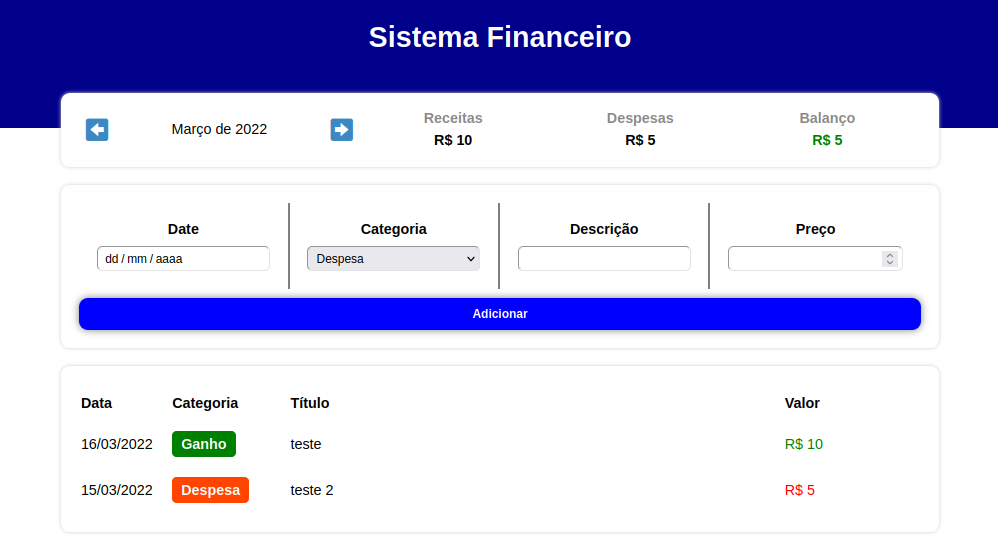

<div align="center" id="top">
  

  &#xa0;

  <!-- <a href="https://controlefinanceiro.netlify.app">Demo</a> -->
</div>

<h1 align="center">Controle Financeiro</h1>

<p align="center">
  

  

  

  


</p>

Status

 <h4 align="center">
	🚧  Controle Financeiro 🚀 Under construction...  🚧
</h4>

<hr>

<p align="center">
  <a href="#dart-about">About</a> &#xa0; | &#xa0;
  <a href="#sparkles-features">Features</a> &#xa0; | &#xa0;
  <a href="#rocket-technologies">Technologies</a> &#xa0; | &#xa0;
  <a href="#white_check_mark-requirements">Requirements</a> &#xa0; | &#xa0;
  <a href="#checkered_flag-starting">Starting</a> &#xa0; | &#xa0;
  <a href="#memo-license">License</a> &#xa0; | &#xa0;
  <a href="https://github.com/LeoScripts" target="_blank">Author</a>
</p>

<br>

## :dart: About ##

p

## :sparkles: Features ##

:heavy_check_mark:  receive date;\
:heavy_check_mark: receive information;\
:heavy_check_mark: select category;\
:heavy_check_mark: receive price;\
:heavy_check_mark: add new item;\
:heavy_check_mark: return balance;\
:heavy_check_mark: return balance;\
:heavy_check_mark: shows every months;\


## :rocket: Technologies ##


- [Node.js](https://nodejs.org/en/)
- [React](https://pt-br.reactjs.org/)
- [TypeScript](https://www.typescriptlang.org/)
- [Styled-Components](https://styled-components.com/)

## :white_check_mark: Requirements ##

Before starting :checkered_flag:, you need to have [Git](https://git-scm.com) and [Node](https://nodejs.org/en/) installed.

## :checkered_flag: Starting ##

```bash
# Clone this project
$ git clone https://github.com/LeoScripts/controle-financeiro

# Access
$ cd controle-financeiro

# Install dependencies
$ npm

# Run the project
$ npm run dev

# The server will initialize in the <http://localhost:3000>
```

## :memo: License ##

This project is under license from MIT. For more details, see the [LICENSE](LICENSE.md) file.


Developed by <a href="https://github.com/LeoScripts}" target="_blank">Leandro Cavalcante</a>

&#xa0;

<a href="#top">Back to top</a>
